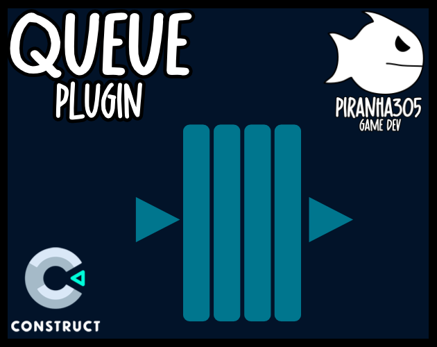
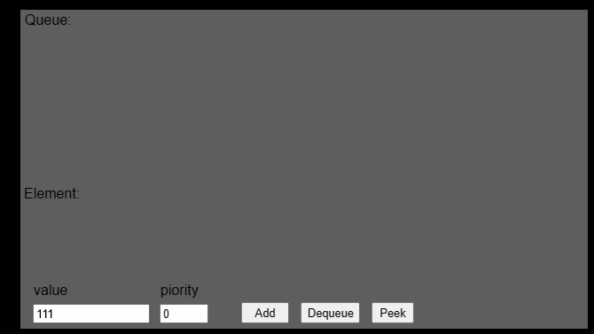

<br>
# Queue <br>
A Construct 3 plugin to store and retrieve data in a priority queue data structure. <br>
<br>
Author: piranha305 <br>
Website: https://piranha305.itch.io/ <br>
Addon Url: https://www.construct.net/en/make-games/addons/1091/queue <br>
Download Latest Version : [Version: 1.0.0.1](https://github.com/armandoalonso/queue/releases/latest) <br>
<sub>Made using [c3ide2-framework](https://github.com/ConstructFund/c3ide2-framework) </sub><br>

## Table of Contents
- [Usage](#usage)
- [Examples Files](#examples-files)
- [Properties](#properties)
- [Actions](#actions)
- [Conditions](#conditions)
- [Expressions](#expressions)
---
## Usage
To build the addon, run the following commands:

```
npm i
node ./build.js
```

To run the dev server, run

```
npm i
node ./dev.js
```

The build uses the pluginConfig file to generate everything else.
The main files you may want to look at would be instance.js and scriptInterface.js

## Examples Files
- [piranha305_queue](./examples/piranha305_queue.c3p)
</br>
</br>

</br>

</br>

---
## Properties
| Property Name | Description | Type |
| --- | --- | --- |


---
## Actions
| Action | Description | Params
| --- | --- | --- |
| Enqueue | Adds a value to the end of the queue. | Value             *(any)* <br> |
| Enqueue with priority | Adds a value to the end of the queue with a priority. | Value             *(any)* <br>Priority             *(number)* <br> |
| Dequeue | Dequeues a value. (can access item from LastDequeuedValue expression) |  |
| Clear | Clears the queue. |  |
| Shuffle | Randomly shuffles queue. |  |
| Load from JSON | Loads the queue from a JSON string. | JSON             *(string)* <br> |


---
## Conditions
| Condition | Description | Params
| --- | --- | --- |
| Is empty | Returns true if the queue is empty. |  |
| Has items | Returns true if the queue has items. |  |
| On last item dequeued | Triggered when the last item is dequeued. |  |
| On item queued | Triggered when an item is queued. (can access item from LastQueued expression) |  |
| On item dequeued | Triggered when an item is dequeued. (can access item from LastDequeuedValue expression) |  |
| Loop queue | Loop through the queue. | Pop items *(boolean)* <br> |


---
## Expressions
| Expression | Description | Return Type | Params
| --- | --- | --- | --- |
| LastDequeuedValue | Returns the last dequeued value. | any |  | 
| Size | Returns the size of the queue. | number |  | 
| Peek | Gets the value at the front of the queue without removing it | any |  | 
| Pop | Dequeues a value and returns it. | any |  | 
| PeekLast | Returns the last item in the queue. (does not remove it from queue) | any |  | 
| LastQueued | Returns the last queued value. | any |  | 
| AsJSON | Returns the queue as a JSON string. | string |  | 
| LoopItem | Returns the current item in the queue. (while looping) | any |  | 
